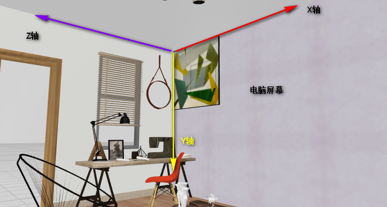
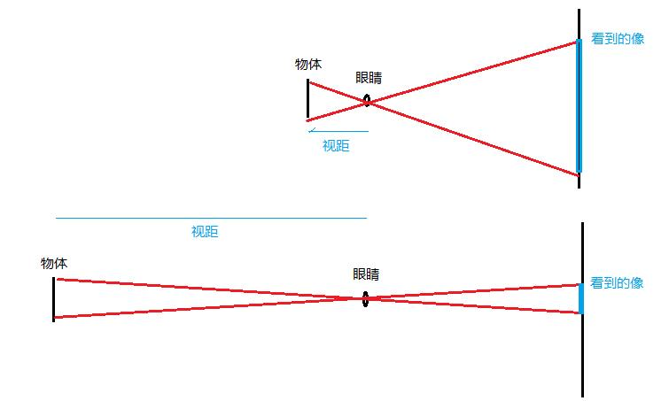
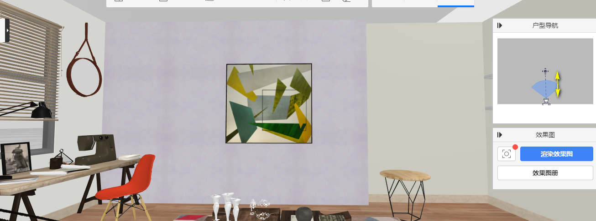
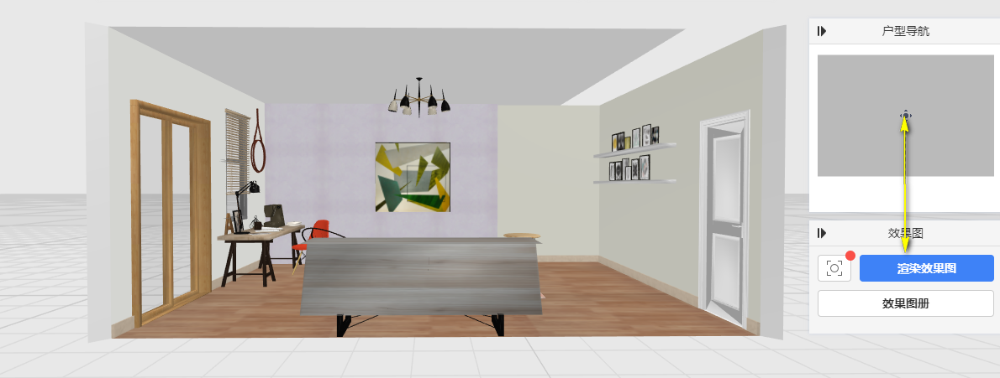
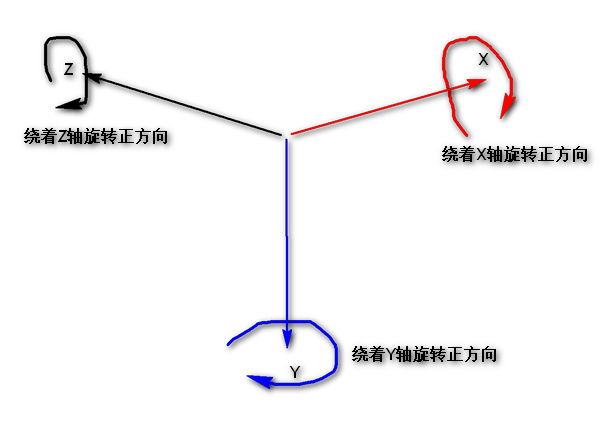
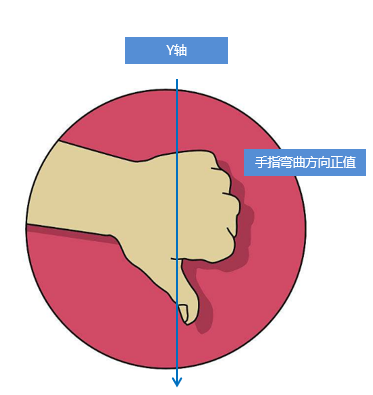
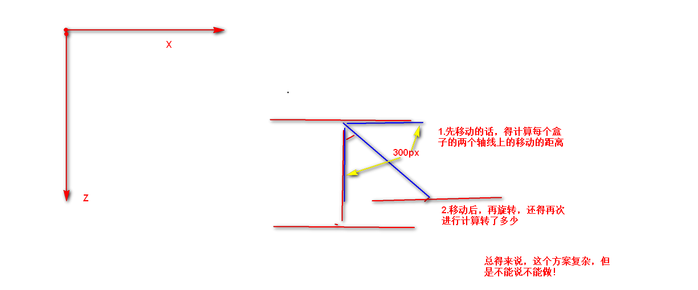
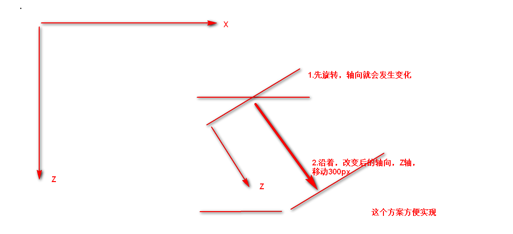

## 01-认识3D转换.avi

1. Z轴在哪里，左手法则；
2. 

## 02-3D转换translate3d.avi

1. translate3d相比translate多了一个Z方向；那么就是可以沿着三个轴进行移动了。

2. 移动：沿着；

3. 语法：

   1. transform:**translate3d**(x,y,z)  其中 **x y z** 分别指要移动的轴的方向的距离
   2. translform:**translateX**(100px)  仅仅是移动在x轴上移动
   3. translform:**translateY**(100px)  仅仅是移动在Y轴上移动
   4. translform:**translateZ**(100px)  仅仅是移动在Z轴上移动

4. 注意：

   1. translform:**translateX**(100%) 沿着X轴 做自身宽度移动；
   2. translform:**translateZ**(100%)  
   3. transform:**translate3d**(x,y,z) 合起来写，不能省略；

   

     

## 03-透视perspective.avi

1. 透视：生活中就是你的眼睛要与被观测的物体拉开距离，拉开距离，就有空间了，才有3D效果，近大远小；

2. 效果：3D效果，近大远小；

3. 生活中：解释近大远小：

   

4. 代码世界：屏幕就是眼睛，盒子就是被观测的物体

   

   

5. 注意：
   1. 设置在父级元素上，设置大于0的PX值；小于0是没有意义的，浏览器也不识别；
   2. 写在被观测元素父盒子上面，这样，才有近（透视的值）大（盒子）远小的感觉；设置的值小，盒子显得大；
   3. **我们先拉开距离，屏幕和盒子先确认好距离，盒子设置的大小，在初始化状态是一样大的；**
6. 总结：视距是干嘛的？**拉开距离，初始化设置**

## 04-translateZ.avi  N

1. 设置好透视，就是视距后，我们之间的距离是不是就固定了，你沿着Z轴值越大，物体是不是进离我眼睛越来越近，我眼睛是不是就看见物体越来越大；
2. 代码中：
   1. 设置好透视，就是把物体先摆放到那个位置，盒子初始化多大就是多大；（透视代码的作用！！！）
   2. 改变透视的距离，再次盒子再Z轴上移动，区别就是 透视小的值，变化相同的Z值，盒子变大得更快；

## 05-3D旋转rotateX.avi   N

1. 回顾2D旋转：正方向是在屏幕在顺时针方向；现在看来，是不是就是绕着Z轴的顺时针逆时针旋转；

2. 3D：**绕着**三个轴顺时针为正；关键字：1.绕着谁，2.顺着时针；

   

3. 左手：

   1. 左手的手拇指指向 x轴的正方向；
   2. 其余手指的弯曲方向就是该元素 绕着 x轴旋转的方向了为顺时针正方向；

3. 语法：
   1. transform: rotateX(45deg);
   2. transform: rotateY(45deg);
   3. transform: rotateZ(-45deg);
   4. transform: rotate3d(1, 0, 0, 45deg); 1只是个矢量的表示。综合写法，知道什么意思即可；
   5. 自定义轴旋转，了解即可；

## 06-3D旋转rotateY.avi

## 07-3D旋转rotateZ.avi

## 08-3D呈现transform-style.avi    N

- transform-style作用：控制子元素是否开启三维立体环境，让子元素做3D转换是能看出3D效果的；
- 步骤：
  1. 视距：使用一次就够了，确认距离，初始化设置大小；！！一般给body加；
  2. 在要有3D效果的子元素的父级盒子，开启3D呈现；

## 09-两面翻转盒子案例.avi   N

步骤：

1. 视距：使用一次就够了，确认距离，初始化设置大小；！！一般给body加；
2. 在要有3D效果的子元素的父级盒子，开启3D空间；不然子元素做的3D 转化什么都看不到；

## 10-3D导航栏（上）.avi    N

## 11-3D导航栏（下）.avi

1. transform: translateY(17.5px) rotateX(-90deg); 这样是因为先旋转后改变轴向，但是不能说不能这样做；
2. transform: rotateX(-90deg) translateZ(17.5px) ; 改变轴向后，按照改变轴向的方式进行移动；

## 12-综合案例-旋转木马案例（上）.avi   N

## 13-综合案例-旋转木马案例（下）.avi

1. 步骤：
   1. 先加透视，知道透视的作用，拉开距离，初始化大小不变。出现近大远小，视距越近，近大远小的程度越剧烈；思考给谁加？
   2. 有个父级盒子下面的子元素要做3D转化，需要给这些子元素开启3D空间，3D空间给谁加？
   3. 这些子盒子怎么去相应的位置；
      1. pink老师的思路：先旋转，后移动。为什么？
      2. 为什么不先移动，再旋转？能不能做？
      3. 没有绝对的写法，只有方便的适合的写法；

## 14-浏览器私有前缀以及总结.avi

- 浏览器私有前缀是为了兼容老版本的写法，比较新版本的浏览器无须添加。
- -moz-：代表 firefox 浏览器私有属性
- -ms-：代表 ie 浏览器私有属性
- -webkit-：代表 safari、chrome 私有属性
- -o-：代表 Opera 私有属性

## 总结：

* **能够说出透视在3D空间的作用：**拉开距离，初始化设置的大小；出现近大远小，视距越近，近大远小的程度越剧烈；思考给谁加？body 

* **能够使用 CSS3 3D转换：移动、旋转和缩放属性：**移动3个轴，需要配置视距。旋转，会改变轴向；

* **能够使用左手法则：**看轴，看怎么转；

* **能够写出如何让子元素开启三维立体环境：**给子元素做的3D转化，开一个3D空间；父级盒子下面的子元素要做3D转化，需要给这些子元素开启3D空间，给谁加？

* **能够写出旋转木马案例：**1,步骤；2.知道为什么先旋转，再移动；

* **能够写出常见的浏览器私有前缀：**看见知道什么意思即可；