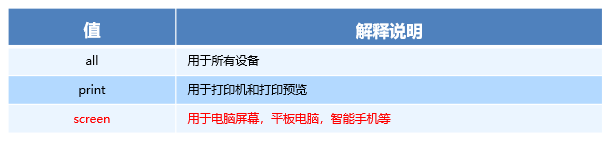
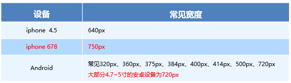
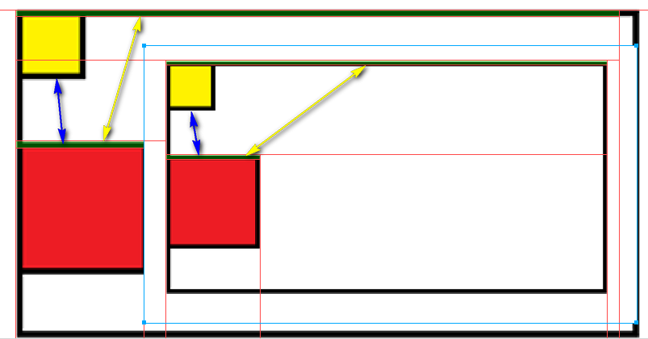
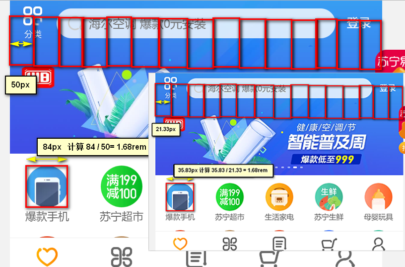
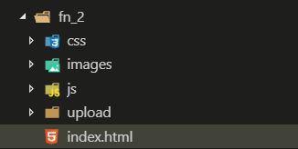

# rem 布局

## 0.目录

* rem 单位的使用
* 媒体查询 
* less 语法，嵌套，运算等特性 ；
* 掌握 2种 rem 布局方案；
* 苏宁易购手机端开发 m.suning.com

## 1. 优势

* 1.页面布局文字能否随着屏幕大小变化而变化？
* 2.流式布局和flex布局主要针对于宽度布局，那么高度如何设置？很小的屏幕里占有很多屏幕；
* 3.如何让屏幕发生变化的时候元素高度和宽度等比例缩放？宽高要等比变化；

## 2. rem  

* 设置rem单位，可以控制整个页面所有元素有关PX类；（宽、高、padding、margin、top...）只要是你设置数值的地方都可以实现控制；
* em，em是 父元素 字体大小，子元素的数值类大小；
* rem (root em)是一个相对单位，r：root--->html元素的字体大小。
* 步骤：
  - 1.设置HTML的字体大小，这个相当于是我们的基本数值；
  - 2.下面的所有的元素的PX类，使用；
```css
/* 1.根html 为 12px */
html {
   font-size: 12px;
}
/* 2.此时 div 的字体大小就是 24px */       
div {
    font-size: 2rem;
}
```

* 小结：1.唯一html，2.控制页面内所有盒子PX类的属性。（宽高、padding....）


## 3. 媒体查询

* 可以帮助我们实现 不同的屏幕 使用不同的样式；

### 3.1 特性

* 1.CSS3 新语法
* 2.@media 可以针对不同的屏幕尺寸 设置 不同的样式；

### 3.2 语法

*  @media 开头 注意@符号

```css
@media mediatype and|not|only (media feature) {
    CSS-Code;
}
```
### 3.3 mediatype 查询 类型

* 将不同的 终端设备 不同的 查询类型，称为媒体类型 screen最为常用



### 3.4 and | not | only 关键字

* 关键字将  媒体类型    或   多个 媒体特性 连接到一起做为媒体查询的条件
* and：可以将多个媒体特性连接到一起，相当于“且”的意思。！！最为常用
* not：排除 某个 媒体类型，相当于“非”的意思，可以省略。@media  print  not {}
* only：指定某个特定的 媒体类型，可以省略。    @media  screen only {}

### 3.5  media feature 媒体特性

* 每种 媒体类型 都具体各自不同的特性，根据不同媒体类型的媒体特性设置不同的展示风格。
* 我们暂且了解三个。注意他们要加小括号包含


 ​

### 3.6 步骤

* 1.媒体查询：可以做到响应不同屏幕，设置不同样式；注意：min-width 、max-width （=），px单位；
* 2.划分档位！！：为了防止混乱，媒体查询 我们要按照从小到大或者从大到小的顺序来写,但是我们最喜欢的还是从小到大来写，这样代码更简洁; 更符合我们的思考；
  * 档位1：w <= 539px; w<540px;
  * 档位2: 540px<= w  and  w<= 969px;
  * 档位3: 970px<= w 


* 1.理解媒体查询，2.理解这个"档位"；

### 3.7 资源引入（了解）

```html
<!-- 320px~640px -->
<link rel="stylesheet" href="style320.css" media="screen and (min-width: 320px)">
<!-- n>=640px -->
<link rel="stylesheet" href="style640.css" media="screen and (min-width: 640px)">
```

## 4.媒体查询+rem 

* 1.响应不同屏幕不同的样式；媒体查询
* 2.档位的划分：从小到大
* 3.档位划分里控制HTML的字体大小，就是下面所有子元素使用rem单位都可以变化；


## 4. less

### 4.1 CSS问题

* 1.不方便维护及扩展，不利于复用；
* 2.CSS 没有很好的计算能力；

### 4.2 介绍 

* 1.Less（Leaner Style Sheets 的缩写）是一门 CSS 扩展语言，也成为 CSS 预处理器。常见的CSS预处理器：Sass、Less、Stylus 。**预处理器**是[程序](https://baike.baidu.com/item/%E7%A8%8B%E5%BA%8F)中处理输入数据，产生能用来输入到其他程序的数据的程序。
* 2.做为 CSS的一种形式的扩展，它并没有减少CSS的功能，而是在现有的CSS语法上，为CSS加入程序式语言的特性。引入了变量，Mixin（混入），运算以及函数等功能，大大简化了 CSS 的编写，并且降低了 CSS的维护成本，
* 3.就像它的名称所说的那样，Less可以让我们用更少的代码做更多的事情。
* Less中文网址：[http://](http://lesscss.cn/)[less](http://lesscss.cn/)[css.cn/](http://lesscss.cn/)
* 一句话：Less是一门 CSS 预处理语言，它扩展了CSS的动态特性。

* 全局安装
> 1. 安装nodejs，可选择版本(8.0)，网址：<http://nodejs.cn/download/>
> 2. 检查是否安装成功，使用cmd命令（win10是 window+r 打开运行输入cmd）  ---输入“node –v”查看版本即可
> 3. 基于nodejs在线安装Less，使用cmd命令“npm install -g less”即可
> 4. 检查是否安装成功，使用cmd命令“ lessc -v ”查看版本即可

* VSC的插件安装
> 1. Easy LESS 插件用来把less文件编译为css文件
> 2. 安装完毕插件，重新加载下 vscode。
> 3. 只要保存一下Less文件，会自动生成CSS文件。


### 4.4 变量

* 变量是指没有固定的值，可以改变的。因为我们CSS中的一些颜色和数值等经常使用。
* 基本：
```css
@变量名:值;
@color: pink;
```

* 必须有@为前缀
* 不能包含特殊字符~==++、不能以数字开头
* 大小写敏感
### 4.5 嵌套

* HTML结构一样写，嵌套着写

```css
/* css 写法 */
#header .logo {
  width: 300px;
}

/* less 写法 */
#header {
  .logo {
      width: 300px;
  }
}
```

* 如果遇见（交集|伪类|伪元素选择器），利用&进行连接

```css
/* css写法 */
a:hover{
    color:red;
}

/* less写法 */
a{
  &:hover{
      color:red;
  }
}
```
* 特点：对应着HTML文档结构写样式；

### 4.6 运算！！！

* 任何数字、颜色或者变量都可以参与运算。就是Less提供了加（+）、减（-）、乘（*）、除（/）算术运算。

* 使用的地方：
  * 1.直接数值与数值的运算，无论是在变量还是直接属性内；
  * 2.颜色与颜色的计算；
  * 3.变量参数运算；
* 运算注意：
> 1. 运算符中间左右有个空格隔开 1px * 5
> 2. 如果两个值之间只有一个值有单位，则运算结果就取该单位
> 3. 对于两个不同的单位的值之间的运算，运算结果的值取第一个值的单位 

## 5. rem 适配 方案

### 5.0  步骤

* 解决问题：让一些不能等比自适应的元素，达到当设备尺寸发生改变的时候，等比例适配当前设备。
* 适配步骤：
  * 1.使用 媒体查询 根据不同设备设置不同的html 的font-size；
  * 2.在某个屏幕下或设计稿，拿到的 html的字体大小（font-size:50px，参考的 尺寸单位 rem）；注意：不要认为font-size是下面的元素的字体大小；
  * 3.在某个屏幕下或设计稿，确认html的font-size，测量 计算得出 元素宽高 比例（2 rem）；
  * 达到：当html字体大小变化，元素尺寸也会发生变化；
* 适配方案
  * 1.媒体查询 + rem + less
  * 2.flexible.js+rem （推荐）
  * 现阶段：两个方案都存在，方案2 更为简单。
* 小结
  * 1.不同屏幕下的html的font-size;
  * 2.得到某个屏幕下的font-size --->拿到我们即将被除以的数值font-size的大小
  * 3.测量：某个屏幕下的元素的 数 值，计算该元素属性的rem；
### 5.1 设计稿

* 常见的设计稿：



* 一般情况下，我们以一套或两套效果图适应大部分的屏幕，放弃极端屏，现在基本以750px为准。

### 5.2 font-size 计算 !!!

* 不同屏幕下的font-size是如何算出的？



* 1.等比缩放，子盒子的宽  /  父盒子的宽 的 比值 是固定的；
* 2.等比缩放，一个子盒子的宽   /  另外一个子盒子的宽  的比值是固定的；就不难理解：



* 步骤：
  * 1.不同屏幕下的html的font-size;
    * 1.1 给我们 750px 设计稿；
    * 1.2 把整个屏幕划分为15等份（划分的份数10或20）；一份就是50px;  1个rem= 50px;
  * 2.得到某个屏幕下的font-size --->拿到我们即将被除以的数值
    * 2.1 750px下的font-size 是50px；
  * 3.测量：某个屏幕下的元素的 数值，计算出 rem；
    * 3.1 测量750px设计稿上的元素，可以计算出 比例：84  / 50 = 1.68 个rem
    * 3.2 不同屏幕下 元素的比例是一直不变的  1.68 。

* 等比的核心：不通屏幕下 划分的份数 都是一样，所以比例都是固定一样的；

### 5.3  两个方案

* 媒体查询 + rem + less ：同一个档位使用的是同一个 font-size 大小；
* flexible.js+rem：直接取到当前屏幕的宽度，除以设置的份数，得出font-size的大小；
  * 简介：手机淘宝团队出的 简洁高效 移动端适配库；
  * github地址：[https://github.com/amfe/lib-flexible](https://link.jianshu.com/?t=https://github.com/amfe/lib-flexible)
  * 不是通过设置CSS媒体查询设置font-size，通过js：

```js
  // set 1rem = viewWidth / 10
  function setRemUnit () {
    var rem = docEl.clientWidth / 10
    docEl.style.fontSize = rem + 'px'
  }
```

* 区别：
  * 1.实现的方式不同，媒体查询 + rem + less ：css;flexible.js+rem:JS实现
  * 2.CSS实现的是划分档位，JS是连续变化；
  * 3.设置的地方不同，css就是在样式内设置，JS是在HTML标签上进行设置；

## 6.案例

### 6.1 媒体查询 + rem + less 

> 1. 苏宁首页地址 ：m.suning.com  设计图： 本设计图采用 750px 设计尺寸
> 2. 搭建文件结构


> 3. 设置视口标签 以及 引入初始化样式

```html
<meta name="viewport" content="width=device-width, user-scalable=no,initial-scale=1.0, maximum-scale=1.0, minimum-scale=1.0">
<link rel="stylesheet" href="css/normalize.css">
```
> 4. 设置公共common.less文件：
>    1. 设置好最常见的屏幕尺寸，利用媒体查询设置不同的html字体大小，因为除了首页其他页面也需要；
>    2. 我们关心的尺寸有 320px、360px、375px、384px、400px、414px、424px、480px、540px、720px、750px；
>    3. 划分的份数我们定为 15等份；
>    4. 因为我们pc端也可以打开我们苏宁移动端首页，我们默认html字体大小为 50px，注意这句话写到最上面；
>    5. 导入：

```css
// 引入：首页的样式less文件
@import "common";
// @import 导入的意思 可以把一个样式文件导入到另外一个样式文件里面
```

* body 样式设置

```css
body {
  min-width: 320px;
  width: 15rem;
  margin: 0 auto;
  line-height: 1.5;
  font-family: Arial, Helvetica;
  background: #F2F2F2;
}
```


### 6.2 flexible.js+rem

* 1.搭建项目结构：



* 2.设置视口和样式初始化

```html
<meta name="viewport" content="width=device-width, user-scalable=no,initial-scale=1.0, maximum-scale=1.0, minimum-scale=1.0">
<link rel="stylesheet" href="css/normalize.css">
```

* 3.引入flexible.js：可以看到默认是划分为10等分；

```js
<!-- 引入我们的flexible.js 文件 -->
<script src="js/flexible.js"></script>
```

* 4.body样式初始化：变化1

```css
body {
  min-width: 320px;
  width: 10rem;
  margin: 0 auto;
  line-height: 1.5;
  font-family: Arial, Helvetica;
  background: #F2F2F2;
}
```

* 5.自定义超过750px宽度的字体大小：变化2

```css
 @media screen and (min-width: 750px) {
    html {
      font-size: 75px!important;
    }
 }
```

* 6.少了LESS，我们需要一个计算功能，VSCode  px 转换rem 插件 cssrem。配置：


## 6. rem 布局 总结

* 1.解决什么问题？流式、flex布局在宽度方向上做布局，高度我们都写死了，在有些小屏下显示不友好。rem布局解决高度上的布局问题；
* 2.怎么解决？步骤：
  * 1.不同屏幕下的html的font-size;
  * 2.得到某个屏幕下的font-size --->拿到我们即将被除以的数值font-size的大小
  * 3.测量：某个屏幕下的元素的 数 值，计算该元素属性的rem；
* 3.实现的方案？
  * 1.媒体查询+rem+less
  * 2.flexible.js+rem;
* 4.注意的地方？
  * 1.使用CSS实现，主要档位的划分，min-,max-包含等于，单位是px；less格式上的使用；
  * 2.使用JS实现，注意划分份数为10默认，rem单位就变化，body初始化样式，超过750px的设置，插件的font-size大小的修改

